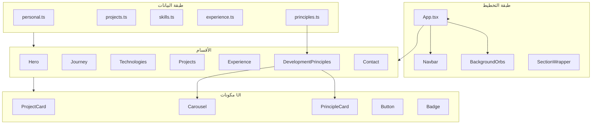

# خطة بناء Portfolio شخصي

## ملخص التحليل

ملف [d.md](d.md) يحدد مواصفات كاملة لموقع Portfolio شخصي بمستوى احترافي عالٍ. المشروع حالياً **فارغ** (يحتوي على `d.md` و `plan.md` فقط)، لذا البناء سيكون من الصفر.

### المتطلبات الأساسية المستخرجة

| المحور | التفاصيل |
|--------|----------|
| التقنيات | React, Vite, TypeScript, Tailwind CSS, Framer Motion, lucide-react |
| الأسلوب البصري | Dark Mode أولاً، أنيق، غامض، فاخر — بدون مظهر قوالب جاهزة أو cyberpunk |
| الألوان | بنفسجي `#7C3AED`، ماجنتا `#BE185D`، خلفية داكنة متدرجة، زجاج شفاف |
| الخطوط | Space Grotesk (عناوين) + Manrope (نص) |
| الأقسام | Hero, Journey, Technologies, Projects, Experience, Development Principles, Contact |
| المعمارية | SPA، مكونات قابلة لإعادة الاستخدام، محتوى منفصل في ملفات data |

### تعديلات هيكلية (محدَّثة)

| التغيير | التفاصيل |
|---------|----------|
| **حذف Testimonials** | إزالة كاملة من الهيكل، التنقل، المخططات، وملفات البيانات |
| **إضافة Development Principles** | قسم جديد يعرض منهجيات هندسية وأنماط clean code واختبار — عبر `principles.ts` |
| **تحديث Experience** | مخطط مرن لطلاب/مرشحي هندسة البرمجيات يدعم أنواعاً متعددة من الإنجازات |

### قرارات مؤكدة

- **لغة الواجهة:** إنجليزي
- **المحتوى:** جاهز — يُزوَّد أثناء التنفيذ

---

## هيكل المشروع المستهدف

```text
Portfolio/
├── public/
├── src/
│   ├── assets/           # صور المشاريع والأيقونات
│   ├── animations/       # variants لـ Framer Motion
│   ├── components/
│   │   ├── ui/           # Button, Badge, Tag, SectionTitle, PrincipleCard...
│   │   ├── layout/       # Navbar, Footer, SectionWrapper, BackgroundOrbs
│   │   └── sections/     # Hero, Journey, Technologies, Projects, Experience, Principles, Contact
│   ├── data/
│   │   ├── projects.ts
│   │   ├── skills.ts
│   │   ├── experience.ts   # مخطط مرن لطلاب الهندسة
│   │   ├── principles.ts   # مبادئ التطوير والهندسة
│   │   └── personal.ts     # الاسم، السيرة، روابط التواصل
│   ├── hooks/            # useScrollPosition, useMediaQuery...
│   ├── types/            # Project, Skill, Experience, Principle, PersonalInfo...
│   ├── utils/            # cn(), formatDate...
│   ├── App.tsx
│   ├── main.tsx
│   └── index.css         # Tailwind directives فقط
├── tailwind.config.ts
├── vite.config.ts
├── tsconfig.json
└── package.json
```

### ترتيب الأقسام في الصفحة والتنقل

```text
#hero → #journey → #technologies → #projects → #experience → #principles → #contact
```



---

## المراحل والخطوات التفصيلية

### المرحلة 1 — التأسيس والإعداد (Foundation)

**الهدف:** إنشاء المشروع وضبط نظام التصميم.

1. **تهيئة المشروع**
   - `npm create vite@latest . -- --template react-ts`
   - تثبيت الاعتماديات:
     - `tailwindcss`, `postcss`, `autoprefixer`
     - `framer-motion`
     - `lucide-react`
     - `clsx` + `tailwind-merge` (لدالة `cn`)

2. **إعداد Tailwind (Premium Dark Theme)**
   - تعريف tokens الألوان في `tailwind.config.ts`:
     - `primary: #7C3AED`
     - `secondary: #BE185D`
     - `background`, `surface`, `text-primary`, `text-secondary`
   - إضافة `rounded-xl` و `rounded-2xl` كقيم افتراضية للبطاقات
   - تفعيل `backdrop-blur-xl` للزجاجية

3. **نظام الخطوط**
   - استيراد Space Grotesk و Manrope من Google Fonts في `index.html`
   - ربطها في Tailwind: `font-heading`, `font-body`

4. **ملف CSS الأساسي**
   - `index.css`: فقط `@tailwind base/components/utilities`
   - تعريف متغيرات CSS للثيم الداكن
   - خلفية متدرجة: `dark purple → black`

**مخرجات المرحلة:** مشروع يعمل مع نظام ألوان وخطوط جاهز.

---

### المرحلة 2 — الهيكل الأساسي والتخطيط (Core Layout)

**الهدف:** بناء الهيكل العام للصفحة والتنقل.

1. **مكونات التخطيط**
   - `SectionWrapper`: غلاف موحد لكل قسم (padding, max-width, id للتنقل)
   - `Navbar`: شريط ثابت بزجاجية
     - شفاف عند التحميل
     - زيادة الشفافية/العتامة عند التمرير (`useScrollPosition`)
     - روابط تنقل سلسة لكل قسم (بدون Testimonials):
       - Home, Journey, Technologies, Projects, Experience, Principles, Contact
   - `Footer`: حقوق + روابط اجتماعية

2. **App.tsx**
   - تجميع كل الأقسام بالترتيب
   - تضمين `BackgroundOrbs` و `Navbar`

3. **Hook مساعد**
   - `useScrollPosition`: تتبع موضع التمرير لتأثير Navbar

**مخرجات المرحلة:** صفحة واحدة بشريط تنقل ثابت وأقسام فارغة.

---

### المرحلة 3 — نظام الخلفية (Background Orbs)

**الهدف:** خلفية حية خفيفة الوزن.

1. **مكون `BackgroundOrbs`**
   - 3–5 دوائر متدرجة (purple, magenta, indigo)
   - `blur-3xl` + opacity 10–20%
   - حركة بطيئة عشوائية بـ Framer Motion (`animate` مع مسارات مختلفة)
   - `position: fixed` + `pointer-events: none` + `z-index` خلف المحتوى

2. **تحسين الأداء**
   - `will-change: transform` بحذر
   - تقليل عدد الـ orbs على الشاشات الصغيرة

**مخرجات المرحلة:** خلفية متحركة أنيقة غير مشتتة.

---

### المرحلة 4 — طبقة البيانات والأنواع (Data Architecture)

**الهدف:** فصل المحتوى عن واجهة المستخدم.

1. **تعريف الأنواع في `src/types/`**
   - `Project`: (id, title, description, image, technologies, githubUrl, liveUrl, featured)
   - `SkillCategory`, `PersonalInfo`, `JourneyMilestone`
   - `Principle`: مبادئ التطوير (انظر أدناه)
   - `ExperienceItem`: مخطط مرن لطلاب الهندسة (انظر أدناه)

2. **ملفات البيانات في `src/data/`**
   - `personal.ts` — الاسم، المسمى الوظيفي، السيرة، روابط التواصل
   - `projects.ts` — المشاريع
   - `skills.ts` — مهارات مصنفة: Frontend, Backend, Databases, Tools
   - `experience.ts` — إنجازات أكاديمية وهندسية (مخطط مرن)
   - `principles.ts` — مبادئ التطوير والهندسة

3. **مبدأ التحديث:** تعديل المحتوى = تعديل ملف data فقط، بدون لمس المكونات.

#### مخطط `Principle` (`src/types/principle.ts`)

```ts
export type PrincipleCategory =
  | 'methodology'      // SOLID, DRY, Separation of Concerns
  | 'architecture'     // Design Patterns, Clean Architecture
  | 'testing';         // TDD, automated testing mentality

export interface Principle {
  id: string;
  title: string;
  description: string;
  category: PrincipleCategory;
  keywords: string[];   // e.g. ["SOLID", "Single Responsibility"]
  icon?: string;        // lucide icon name
}
```

#### مخطط `ExperienceItem` — مرن لطلاب/مرشحي الهندسة

```ts
export type ExperienceType =
  | 'academic_milestone'    // درجات، شهادات، معالم أكاديمية
  | 'university_project'    // أنظمة جامعية كبيرة الحجم
  | 'internship'            // تدريب عملي
  | 'technical_volunteering'// تطوع تقني
  | 'hackathon';            // هاكاثونات ومسابقات

export interface ExperienceItem {
  id: string;
  type: ExperienceType;
  title: string;
  organization: string;     // الجامعة، الشركة، الفريق...
  description: string;
  startDate: string;          // ISO أو "2023-09"
  endDate?: string;           // اختياري — "Present" للجاري
  technologies?: string[];
  highlights?: string[];      // نقاط بارزة
  link?: string;              // رابط مشروع أو شهادة
}
```

**مخرجات المرحلة:** بنية بيانات typed وجاهزة لاستقبال المحتوى الشخصي.

---

### المرحلة 5 — مكونات UI القابلة لإعادة الاستخدام

**الهدف:** بناء لبنات الواجهة المشتركة.

1. **مكونات أساسية (`components/ui/`)**
   - `Button` — أساسي / شفاف / مع أيقونة
   - `Badge` / `Tag` — لتقنيات المشاريع والكلمات المفتاحية
   - `SectionTitle` — عنوان قسم + وصف فرعي
   - `GlassCard` — بطاقة زجاجية عامة
   - `PrincipleCard` — بطاقة مبدأ هندسي (عنوان، وصف، فئة، keywords)

2. **`ProjectCard`**
   - زجاجية + ظل أنيق
   - صورة بنسبة ثابتة + `object-cover` + تكبير عند hover
   - عنوان، وصف، tags تقنية
   - أزرار GitHub و Live Demo
   - تأثيرات hover: رفع البطاقة + glow بنفسجي + scale للصورة

3. **`Carousel`**
   - API: `<Carousel items={data} renderItem={...} variant="default" | "principles" />`
   - سحب بالماوس + swipe باللمس
   - أسهم تنقل + مؤشرات pagination
   - قابل لإعادة الاستخدام في Projects و Development Principles
   - variant `principles`: تخطيط أوسع مع `PrincipleCard` ومسافات مريحة

**مخرجات المرحلة:** مكتبة مكونات جاهزة للأقسام.

---

### المرحلة 6 — بناء الأقسام السبعة (Sections)

**الهدف:** تنفيذ كل قسم من المواصفات المحدَّثة.

| القسم | المكون | المحتوى من | id |
|-------|--------|-----------|-----|
| Hero | `HeroSection` | `personal.ts` | `#hero` |
| Journey | `JourneySection` | `personal.ts` + timeline | `#journey` |
| Technologies | `TechnologiesSection` | `skills.ts` | `#technologies` |
| Projects | `ProjectsSection` | `projects.ts` + ProjectCard/Carousel | `#projects` |
| Experience | `ExperienceSection` | `experience.ts` — timeline عمودي مرن | `#experience` |
| Development Principles | `PrinciplesSection` | `principles.ts` + Carousel/Grid | `#principles` |
| Contact | `ContactSection` | `personal.ts` — روابط مباشرة / mailto | `#contact` |

**تفاصيل كل قسم:**

- **Hero:** اسم كبير، مسمى وظيفي، CTA (View Projects / Contact Me)، تأثير fade-in
- **Journey:** قصة شخصية + مسار تعلم — timeline أو خطوات متتابعة
- **Technologies:** شبكة فئات مع أيقونات/أسماء التقنيات
- **Projects:** عرض المشاريع المميزة (`featured: true`) في grid أو carousel
- **Experience:** خط زمني عمودي مع أيقونات حسب `ExperienceType` — يدعم المعالم الأكاديمية، المشاريع الجامعية الكبيرة، التدريب، التطوع التقني، والهاكاثونات
- **Development Principles:**
  - محتوى من `principles.ts` فقط — منهجيات هندسية، SOLID/DRY/Design Patterns، عقلية الاختبار الآلي
  - عرض عبر `<Carousel variant="principles" />` على الموبايل/التابلت
  - أو spatial grid مصقول على الديسكتوب (2–3 أعمدة مع stagger animation)
  - تصنيف بصري حسب `PrincipleCategory` (methodology / architecture / testing)
- **Contact:** بريد، LinkedIn، GitHub + mailto

**مخرجات المرحلة:** صفحة كاملة بكل المحتوى.

---

### المرحلة 7 — الحركة واللمسات النهائية (Motion & Polish)

**الهدف:** تجربة مستخدم فاخرة وسلسة.

1. **Framer Motion**
   - `animations/variants.ts`: fadeIn, staggerContainer, slideUp
   - reveal عند التمرير (`whileInView` + `viewport: { once: true }`)
   - stagger للعناصر المتعددة (skills, projects, principles grid)
   - hover interactions خفيفة

2. **التجاوب (Responsive)**
   - Mobile First
   - Navbar → قائمة hamburger على الموبايل
   - Grid يتكيف: 1 عمود موبايل → 2 تابلت → 3 ديسكتوب
   - Principles: carousel على الشاشات الصغيرة، grid على الكبيرة

3. **اللمسات النهائية**
   - مراجعة التباين والوصولية (a11y)
   - تحسين meta tags و title
   - favicon
   - اختبار على أحجام شاشات مختلفة

**مخرجات المرحلة:** موقع جاهز للإنتاج.

---

## قائمة المهام (To-Do)

| # | المرحلة | الحالة |
|---|---------|--------|
| 1 | تهيئة Vite + React + TS + Tailwind + Framer Motion ونظام التصميم | **مكتملة** |
| 2 | بناء Navbar زجاجي، SectionWrapper، Footer، و App.tsx (7 أقسام بدون Testimonials) | **مكتملة** |
| 3 | تنفيذ BackgroundOrbs بحركة بطيئة وblur خفيف | **مكتملة** |
| 4 | إنشاء types/ و data/ (principles.ts + experience schema مرن) | **مكتملة** |
| 5 | بناء مكونات UI — Button, Badge, GlassCard, ProjectCard, PrincipleCard, Carousel | **مكتملة** |
| 6 | بناء الأقسام السبعة (Hero → Principles → Contact) وربطها بالبيانات | **مكتملة** |
| 7 | Framer Motion animations، responsive، ولمسات نهائية للإنتاج | **مكتملة** |

---

## ما أحتاجه منك عند بدء التنفيذ

عند الانتقال من التخطيط إلى التنفيذ، زوّدني بالتالي:

1. **معلومات شخصية:** الاسم الكامل، المسمى الوظيفي، نبذة قصيرة (2–3 جمل)
2. **رحلة التعلم:** نقاط رئيسية في مسارك (3–5 محطات)
3. **المهارات:** قائمة مصنفة (Frontend, Backend, Databases, Tools)
4. **المشاريع:** لكل مشروع — عنوان، وصف، صورة، تقنيات، روابط GitHub/Live
5. **الخبرات:** معالم أكاديمية، مشاريع جامعية، تدريب، تطوع تقني، هاكاثونات — مع التواريخ والتقنيات
6. **مبادئ التطوير:** المبادئ الهندسية التي تؤمن بها (SOLID, DRY, TDD...) مع وصف مختصر لكل مبدأ
7. **روابط التواصل:** GitHub, LinkedIn, Email, وأي روابط أخرى

---

## ترتيب التنفيذ المقترح

```mermaid
gantt
    title خطة التنفيذ
    dateFormat X
    axisFormat %s

    section التأسيس
    تهيئة المشروع والتصميم     :p1, 0, 1
    section التخطيط
    Layout و Navbar            :p2, 1, 2
    Background Orbs            :p3, 2, 3
    section البيانات
    Types و Data files         :p4, 3, 4
    section المكونات
    UI Components              :p5, 4, 5
    ProjectCard و Carousel     :p6, 5, 6
    section الأقسام
    Hero و Journey             :p7, 6, 7
    Tech و Projects            :p8, 7, 8
    Experience و Principles    :p9, 8, 9
    Contact                    :p10, 9, 10
    section اللمسات
    Animations و Responsive    :p11, 10, 11
    Polish نهائي               :p12, 11, 12
```



---

## معايير النجاح

- الموقع يعمل محلياً بدون أخطاء TypeScript
- كل المحتوى قابل للتعديل من ملفات `src/data/` فقط
- لا يوجد قسم Testimonials في أي مكان (تنقل، بيانات، مكونات)
- قسم Development Principles يعمل بالكامل من `principles.ts`
- مخطط Experience يدعم جميع أنواع `ExperienceType` الخمسة
- التصميم dark-first أنيق وفاخر — لا يبدو كقالب جاهز
- متجاوب على موبايل، تابلت، وديسكتوب
- حركات Framer Motion سلسة وخفيفة
- مكونات Carousel و ProjectCard و PrincipleCard قابلة لإعادة الاستخدام
- جودة كود production-ready

---

## ملاحظة

جميع المراحل **مكتملة** — الموقع جاهز للإنتاج. عدّل `src/data/` بمحتواك النهائي.
